# Mooncake 传输前聚合（Staging Coalescing）方案

## 1. 方案概述

Mooncake 传输前聚合（Staging Coalescing）解决的是 **Mooncake 多缓冲语义下 KV cache 传输效率低** 的问题。在 Mooncake 的 KV 传输中，一个 Store 对象 Key 可能映射到多个分散的 Block 切片（Mooncake 多缓冲语义），直接传输这些分散的切片会导致 Mooncake 内部产生大量小粒度传输操作，显著降低带宽利用率和传输效率。

本方案的核心思路是：**在传输前，将同一个 Key 的多个分散 Block 切片拷贝到连续的 Staging 缓冲区中，使 Mooncake 传输一个紧凑的连续数据块；在 Get 完成后，再将数据从 Staging 缓冲区拷贝回原始的分散 Block 地址。**

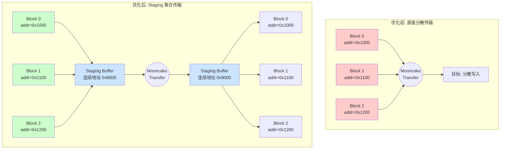

## 2. 背景与动机

### 2.1 问题背景

在 Mooncake 分布式 KV 传输中，每次 `put`/`get` 操作可以携带多个 Buffer（多缓冲语义）。然而，同一个 Key 的多个 Buffer 在 NPU 内存中通常是**分散存储**的：

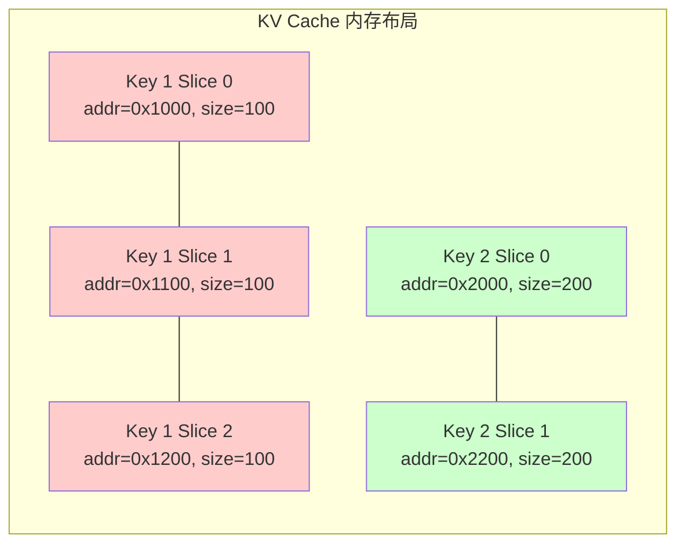

**同一个 Key 对应多个 Slice 的原因**：

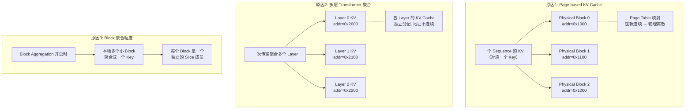

| 原因 | 说明 |
|------|------|
| **Page-based KV Cache** | vLLM 使用 PageTable 管理 KV Cache，一个 Sequence 的 KV 数据被分散存储在多个非连续的 Physical Block 中。每个 Block 是一个独立的 Slice。 |
| **多层 Transformer 聚合** | 一次传输可以聚合多个 Transformer Layer 的 KV Cache。各 Layer 的 KV 独立分配，地址不连续，因此每个 Layer 对应一个或多个 Slice。 |
| **Block 聚合粒度** | 当开启 Block Aggregation 时，本地多个小 Block 被聚合成一个 Key 进行传输，每个 Block 作为该 Key 的一个 Slice 成员。 |

### 2.2 直接传输的问题

直接向 Mooncake 传递这些分散的 Buffer 地址列表，Mooncake 需要为每个小 Buffer 单独发起传输操作，导致：

- **传输粒度小**：每个传输操作的数据量小，无法充分利用带宽
- **协议开销大**：每个传输操作都有额外的握手/确认开销
- **传输引擎压力大**：大量小请求使传输引擎处理队列膨胀

### 2.3 关键设计决策

| 决策       | 选择                                           | 理由                                |
| ---------- | ---------------------------------------------- | ----------------------------------- |
| 聚合粒度   | 按 Key 聚合                                    | 保持 Key 级别的语义，不影响上层逻辑 |
| 缓冲区管理 | 预分配池化                                     | 避免运行时频繁分配/释放 NPU 内存    |
| 拷贝引擎   | Triton 批处理 memcpy Kernel                    | 指针级操作，避免 Tensor 视图限制    |
| 配置方式   | `mooncake.json` 配置 `staging_buffer_size` | 灵活适配不同场景                    |

## 3. 整体架构

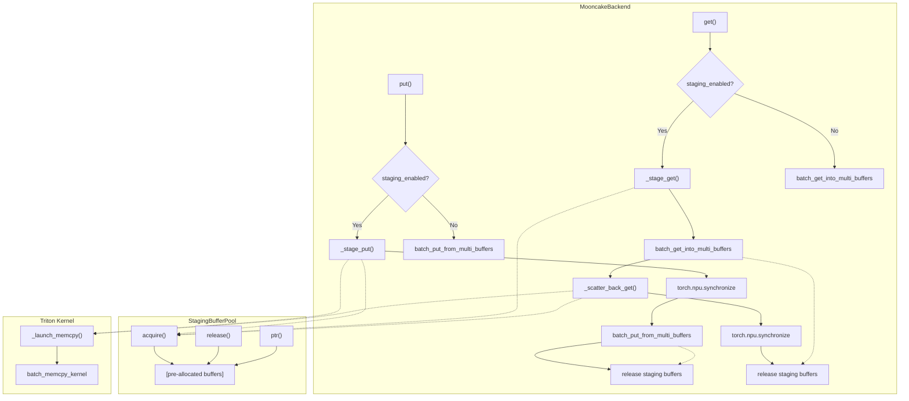

### 3.1 核心组件

| 组件                    | 职责                                                                    |
| ----------------------- | ----------------------------------------------------------------------- |
| `_StagingBufferPool`  | 预分配的连续 NPU Staging 缓冲区池，支持按需增长                         |
| `_chunk_members()`    | 将 Key 的分散成员按`staging_buffer_size` 划分为 Chunk（不跨成员分割） |
| `_stage_put()`        | Put 前将分散成员拷贝到连续 Staging 缓冲区                               |
| `_stage_get()`        | Get 前预留连续 Staging 缓冲区，用于接收 Mooncake 传输结果               |
| `_scatter_back_get()` | Get 完成后将 Staging 缓冲区中的数据拷贝回原始分散地址                   |
| `_launch_memcpy()`    | 启动 Triton 批处理 Memcpy Kernel，执行指针级拷贝操作                    |

## 4. 核心模块设计

### 4.1 StagingBufferPool

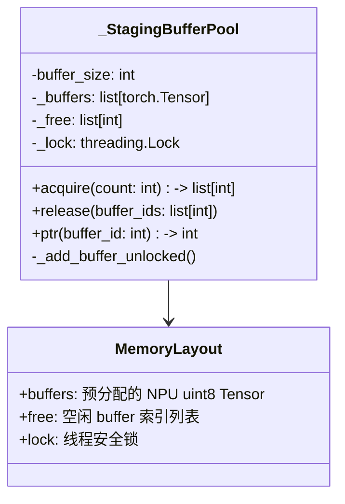

**设计要点**：

1. **预分配**：初始化时预分配 `DEFAULT_STAGING_NUM_BUFFERS(4)` 个连续缓冲区，每个缓冲区大小为 `staging_buffer_size`
2. **按需扩容**：`acquire()` 时如果空闲缓冲区不足，自动增加新缓冲区
3. **线程安全**：使用 `threading.Lock` 保护池的分配/释放操作
4. **注册传输引擎**：非 Fabric 内存模式下，新分配的缓冲区会注册到全局传输引擎

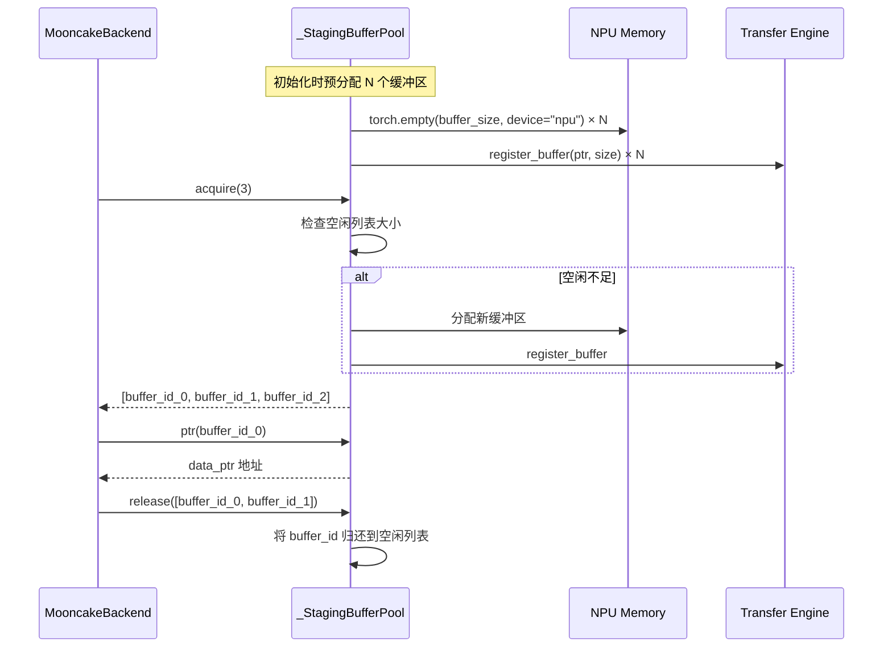

### 4.2 Chunk 划分策略

`_chunk_members()` 方法负责将 Key 的分散成员划分为大小不超过 `staging_buffer_size` 的 Chunk。

**划分规则**：

1. 只有 **多于 1 个 Buffer** 的 Key 才需要 Staging
2. 成员数据**不会跨 Chunk 分割**（避免语义复杂化）
3. 同一 Key 的成员按顺序打包，直到总大小超过 `staging_buffer_size` 时新开 Chunk

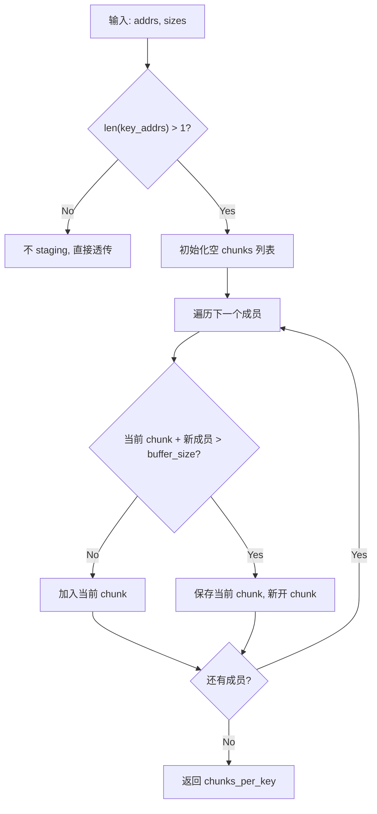

**示例**：Key 1 有 3 个成员，大小分别为 100、100、100，`staging_buffer_size = 160`

```
Chunk 0: [成员0(100), 成员1(100)] → total=200>160, 溢出
          → 实际: Chunk 0 [成员0(100)], total=100
Chunk 1: [成员1(100), 成员2(100)] → total=200>160, 溢出
          → 实际: Chunk 1 [成员1(100)], total=100
Chunk 2: [成员2(100)], total=100
```

### 4.3 Put 流程

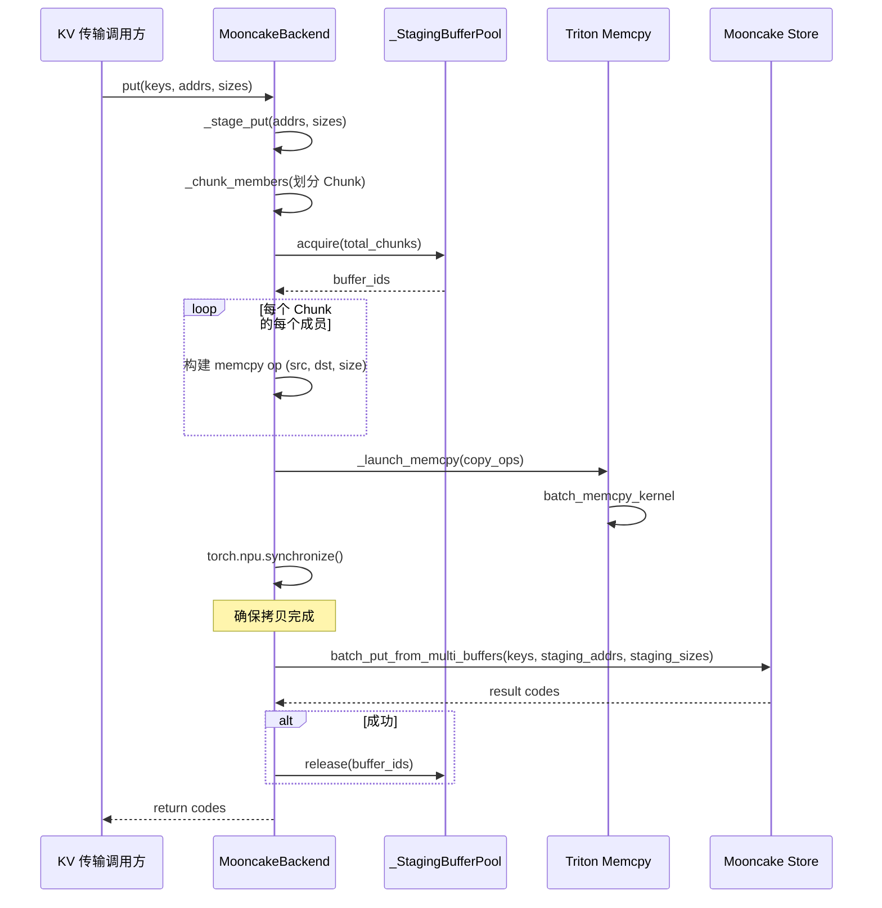

### 4.4 Get 流程

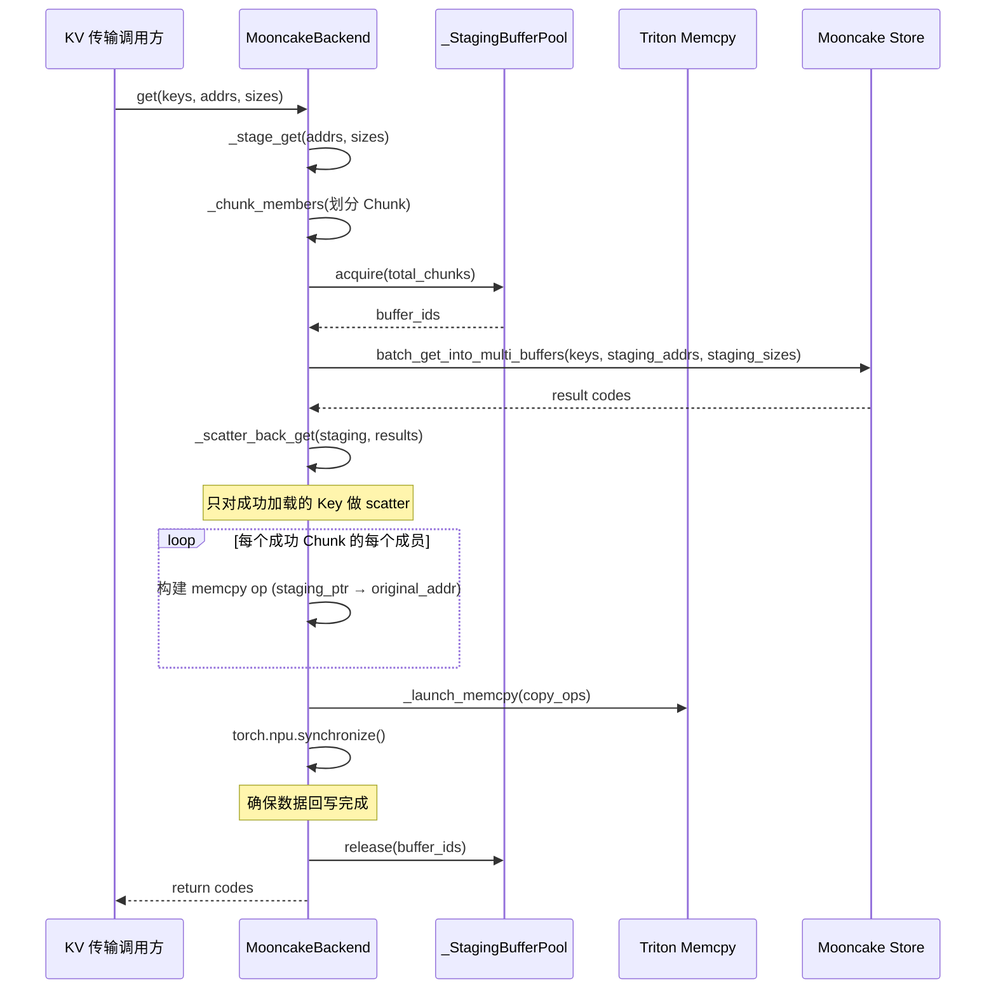

**错误处理**：

- 如果 Staging 过程本身失败（如 OOM），会 Fallback 到直接多缓冲传输
- 如果某个 Key 的 Get 失败（result code < 0），跳过该 Key 的 Scatter-back

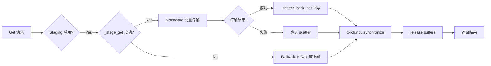

---

## 5. 性能优化

> 本章节对应 Commit `b550aff885086ba8d1271a24e2c3a15504f8864b`，在基础 Staging 方案之上进行的性能优化。

### 5.1 优化概览

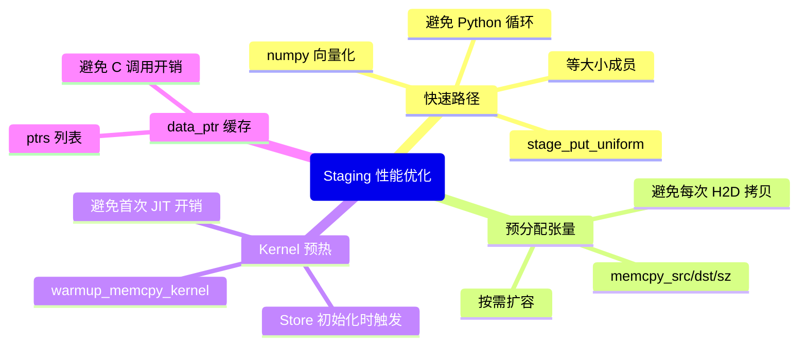

### 5.2 _stage_put_uniform 快速路径

**背景**：在实际的 KV 传输场景中，同一个 Key 的所有 Block 切片通常具有**相同的大小**（例如均为 80 字节）。通用的 `_chunk_members` 方法使用 Python 循环逐成员处理，当成员数量很大时效率较低。

**优化方案**：`_stage_put_uniform()` 检测所有成员大小是否相同，如果是则使用 **numpy 向量化计算** 替代 Python 循环。

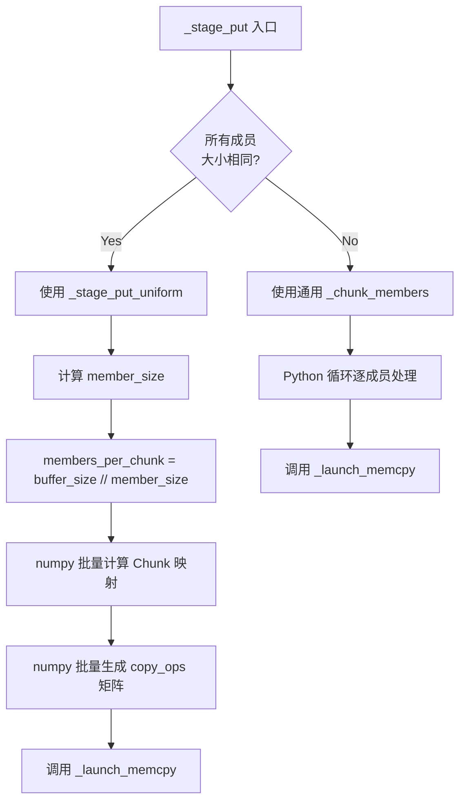

**numpy 向量化计算流程**：

```mermaid
graph LR
    A[addrs 列表] --> B[np.fromiter 展平为 srcs 数组]
    C[sizes 列表] --> D[counts = per-key 成员数]
    D --> E[key_ids = 按 counts 展开]
    E --> F[within = 每个成员在 Key 内的位置]
    F --> G[global_chunk = 全局 Chunk 索引]
    G --> H[offsets = within % members_per_chunk × member_size]
    H --> I[copy_ops = np.stack(srcs, base+offsets, member_size)]
    I --> J[_launch_memcpy(copy_ops)]
```

**性能对比**：

| 操作            | 通用路径 (Python 循环) | 快速路径 (numpy 向量化) |
| --------------- | ---------------------- | ----------------------- |
| 1000 个成员耗时 | ~毫秒级                | ~微秒级                 |
| 计算复杂度      | O(n) Python 循环       | O(n) 向量化 + C 级并行  |
| 内存分配        | 逐 tuple 分配          | 批量 numpy 数组         |

### 5.3 预分配 NPU 张量

**背景**：`_launch_memcpy()` 每次调用需要将拷贝操作的 `(src_ptr, dst_ptr, size)` 三元组传输到 NPU 设备。原始实现使用 `torch.tensor([...])` 从 Python 列表创建，这涉及：

1. Python 列表 → CPU Tensor 的内存分配
2. CPU Tensor → NPU Tensor 的 H2D 拷贝

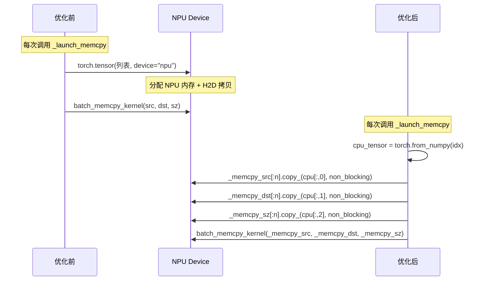

**优化方案**：

- 在 `MooncakeBackend` 初始化时预分配 3 个 NPU int64 Tensor（`_memcpy_src`、`_memcpy_dst`、`_memcpy_sz`），初始容量为 0
- 首次调用时扩容到 `max(1024, n * 2)`，后续每次调用只做 `copy_()` 操作
- `copy_()` 使用 `non_blocking=True`，允许与计算流水线重叠

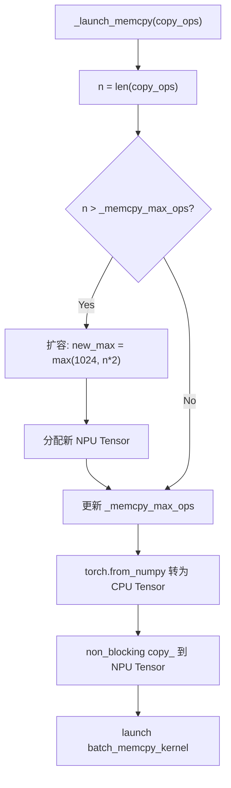

### 5.4 Kernel 预热

**背景**：Triton Kernel 首次执行时需要进行 JIT 编译，这在首次 `put`/`get` 请求中引入额外延迟。

**优化方案**：`_warmup_memcpy_kernel()` 在 Store 初始化时立即触发一次最小规模的 Memcpy 操作，将 JIT 编译开销提前到初始化阶段。

```mermaid
gantt
    title Kernel 预热效果
    dateFormat  X
    axisFormat %s

    section 优化前
    初始化 Store           : 0, 2
    首次 Staging 请求 (含 JIT) : 2, 5
    后续 Staging 请求       : 7, 2

    section 优化后
    初始化 Store + 预热     : 0, 4
    首次 Staging 请求 (无 JIT) : 4, 2
    后续 Staging 请求       : 6, 2
```

**触发时机**：

1. `__init__` 中非懒初始化时
2. `ensure_initialized()` 懒初始化时

```python
def _warmup_memcpy_kernel(self) -> None:
    if not self._staging_enabled:
        return
    try:
        src = torch.empty(1, dtype=torch.uint8, device="npu")
        self._launch_memcpy([(src.data_ptr(), src.data_ptr(), 1)])
    except Exception:
        logger.warning("Staging memcpy kernel warm-up failed; ...")
```

### 5.5 data_ptr 缓存

**背景**：`_StagingBufferPool.ptr()` 需要获取缓冲区 Tensor 的 `data_ptr()`。`torch.Tensor.data_ptr()` 是一个 Python C 调用，每次调用都有固定的开销。

**优化方案**：在 `_StagingBufferPool` 中增加 `_ptrs` 列表，在 `_add_buffer_unlocked()` 时缓存 `data_ptr()` 值，`ptr()` 方法直接查表返回。

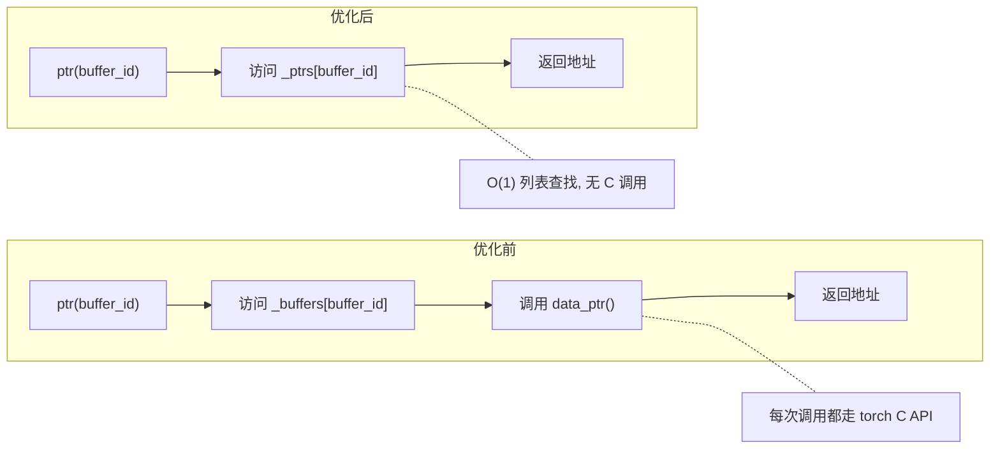

### 5.6 优化效果总结

| 优化项        | 优化前                                      | 优化后                          | 效果                      |
| ------------- | ------------------------------------------- | ------------------------------- | ------------------------- |
| 快速路径计算  | Python 循环 O(n)                            | numpy 向量化 O(n)               | 计算耗时降低 1-2 个数量级 |
| NPU 张量分配  | 每次调用`torch.tensor(..., device="npu")` | 预分配 +`copy_(non_blocking)` | 消除分配和 H2D 拷贝开销   |
| Kernel 预热   | 首次请求时 JIT 编译                         | 初始化时预热                    | 消除首次请求的 JIT 延迟   |
| data_ptr 查询 | 每次`torch.Tensor.data_ptr()`             | 预缓存列表                      | 消除 C API 调用开销       |

## 6. 配置说明

在 `mooncake.json` 中配置 `staging_buffer_size` 来启用 Staging 聚合：

```json
{
    "metadata_server": "10.0.0.1:12345",
    "global_segment_size": "1G",
    "local_buffer_size": "1G",
    "staging_buffer_size": "1G",
    "prefer_alloc_in_same_node": true
}
```

| 参数                            | 说明                                              | 默认值   |
| ------------------------------- | ------------------------------------------------- | -------- |
| `staging_buffer_size`         | Staging 缓冲区大小（字节），设为 0 时禁用 Staging | `0`    |
| `DEFAULT_STAGING_NUM_BUFFERS` | 预分配的 Staging 缓冲区数量                       | `4`    |
| `STAGING_COPY_BLOCK_SIZE`     | Triton Memcpy Kernel 的 BLOCK_SIZE                | `8192` |

## 7. 平台兼容性

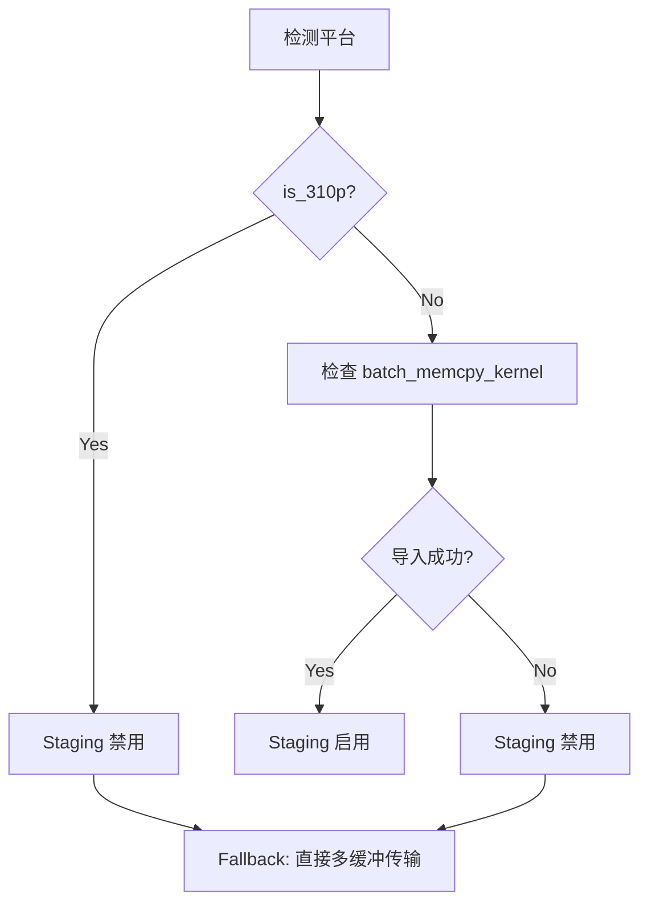

- Ascend 910B/910C：支持 Staging（使用 Triton 指针级 Memcpy Kernel）
- Ascend 310P：不支持 Staging（Kernel 不可用）
- 若 `staging_buffer_size > 0` 但平台不支持，会输出 WARNING 日志并自动 Fallback
